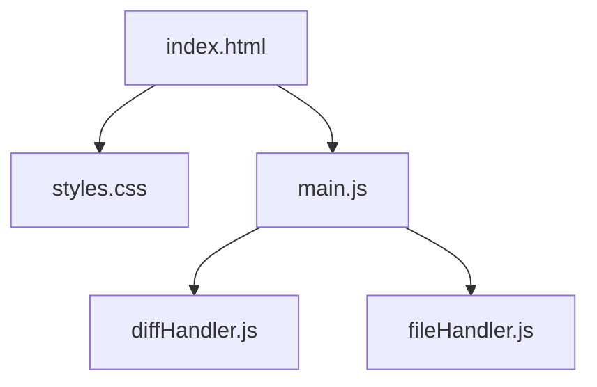
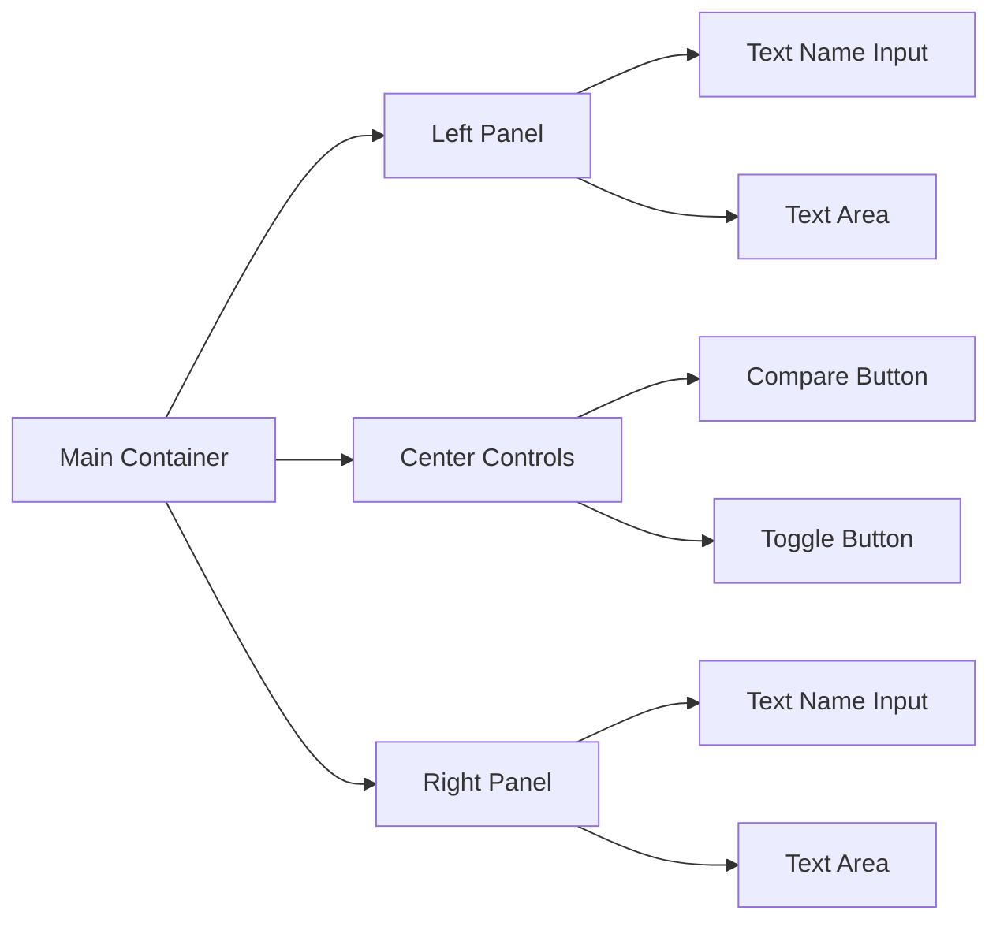

# Text Comparison Tool Implementation Plan

## Project Overview
A web-based text comparison tool that allows users to compare text in two windows with highlighting similar to Notepad++, featuring text toggle functionality and local storage capabilities.

## Technical Stack
- Frontend: HTML5, CSS3, Vanilla JavaScript
- Text Diff Library: `diff-match-patch` or similar JS library
- Storage: Browser's Local Storage API
- UI: Native HTML/CSS

## Architecture

### Project Structure


### UI Components


## Core Features

### 1. Text Comparison
- Implement text diff algorithm using a library
- Highlight additions in green
- Highlight deletions in red
- Highlight modifications in yellow

### 2. Text Management
- Toggle functionality to swap text between panels
- Auto-save to prevent loss of work
- Local storage integration for saving named texts

### 3. UI/UX Features
- Responsive design for different screen sizes
- Clear visual indicators for differences
- Easy-to-use interface with intuitive controls

## Implementation Phases

### Phase 1: Basic Structure
- Set up HTML structure with two text areas
- Create basic CSS styling
- Implement basic JavaScript structure

### Phase 2: Core Functionality
- Implement text comparison logic
- Add text highlighting
- Create toggle functionality

### Phase 3: Storage Features
- Add name input fields
- Implement local storage saving
- Add file management functions

### Phase 4: UI Enhancement
- Improve styling and visual feedback
- Add loading states
- Implement responsive design

### Phase 5: Testing & Refinement
- Cross-browser testing
- Performance optimization
- Bug fixes and improvements

## File Structure
```
text-diff/
├── index.html
├── css/
│   └── styles.css
├── js/
│   ├── main.js
│   ├── diffHandler.js
│   └── fileHandler.js
└── README.md